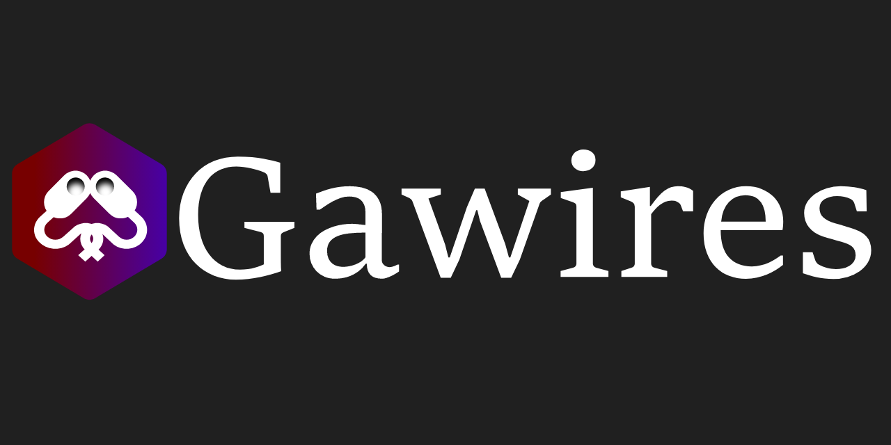

# Gawires

> **Gawires is still in its design phase (yea... Been a while!) and is actually unusable. I am currently pretty busy with my company Deuzspark Technologies, but i am hoping to have some more time soon to explain the concept and design in a github page! If you're tired of perforce prohibitiveness, find git lacking for project with lot of binaries and want to join me for development feel free to reach out :)**

Gawires(a.k.a *Game Assets Wires*) is a new genre version control system designed around making the management of large projects like video games simpler.

Gawires is written entirely in *Rust-Lang* to provide the best performance. It is also my first project ever using rust but i think this is an incredible langage that fit into the goal of gawires!

This vcs try to solves the problem of other vcs like git, that is challenging in large project with larger teams and Perforce that add much useless complexity(And is pretty expensive).

This will be a long road but i think that the arts and game industry needs something new for their own reality instead of relying to some general solution. We work with much more complex and large files like 3d files, textures, sounds and more. And those also need to be controlled and versionned. Thus my plan is to make this vcs different than what is available, thus using modern and awesome technologies.

Feel free to join me if you have any questions or want to give an hand! Thanks :)

## What is the Asset Gist?

In Gawires, each tracked assets have their own tree structure that represent their changes and versions.

The **Asset Gist** is in charge of keeping all records of the assets modifications but when using Gawires, the users don't directly access the **Gist**. They will act on a specific set of workspaces part of their repository, worspaces can track project wide assets or have their own forks of those.

Since the gist is the global manager of any assets, even multiple projects can share the same assets without the need to store multiple copies.

Through a workspace, assets can be locally checkout as on-demand or entirely, if it's more convenient.
